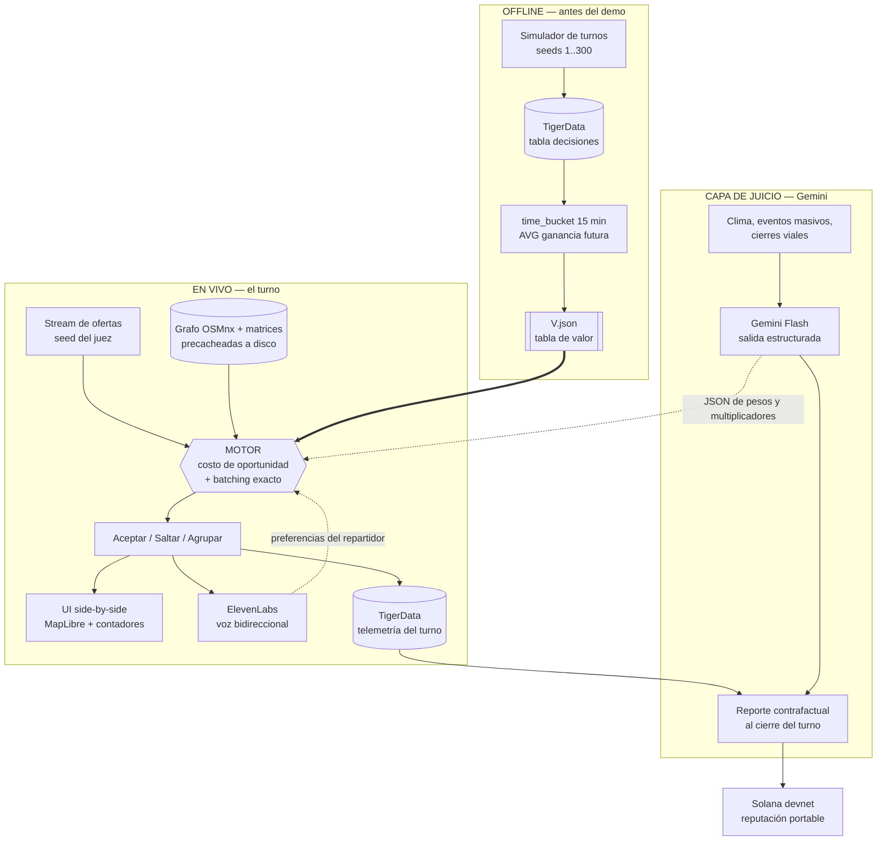
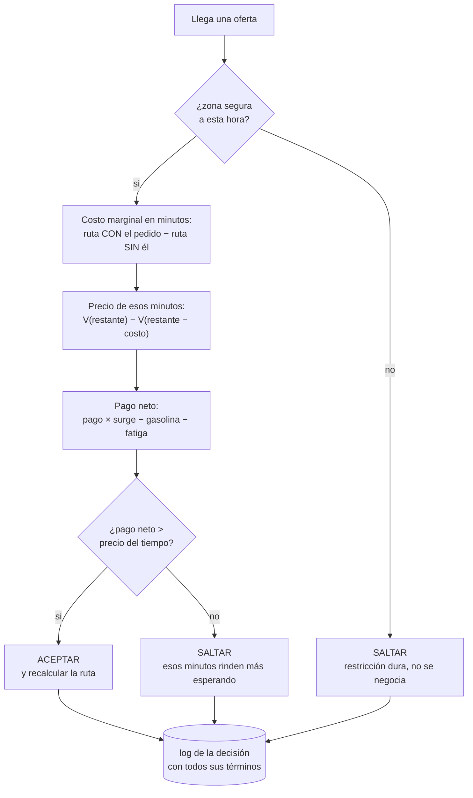

# The Courier — HackMTY 2026 / Reto Infosys

Documento de contexto del proyecto. Lo que decidimos, por qué, y cómo se trabaja aquí.

---

## 1. El reto

> Dado un flujo de ofertas de entrega, tráfico y un turno limitado, ¿puede un agente de IA
> ganar lo máximo para un repartidor, como lo haría un conductor experimentado?

**Criterios de evaluación (solo dos):**

| Criterio | Qué miden |
|---|---|
| **Results** | En un turno fresco que no vimos, cuánto gana el agente vs un baseline simple |
| **Judgment** | ¿Toma decisiones seguras y sensatas bajo surge/tráfico, y puede explicárselas a un juez? |

**Lectura estratégica:** la mitad del puntaje no es el algoritmo, es que el agente
**sepa defender su decisión**. Casi todos los equipos van a construir un optimizador y una
gráfica. Gana el que construya un optimizador **que hable**.

Entregable pedido explícitamente por el reto: código funcionando + demo en vivo donde
**dos agentes corren el mismo turno fresco lado a lado**, con un contador de ganancias
corriendo, y un **surge o un cierre vial** a mitad del turno al que deben reaccionar.

---

## 2. La idea

**"El Copiloto del Repartidor"** — un agente que corre el turno y le dice al oído, en voz alta
y en español regio, qué hacer y por qué.

```
[ping] "Rappi, Contry a San Pedro, $48."
Copiloto: "Salta. Son 22 minutos contra tráfico y te saca de la zona caliente.
           En 6 minutos entra el surge en Valle. Aguanta ahí."
```

Un repartidor en moto a 40°C **no lee una pantalla**. La voz no es un add-on para ganar un
track: es la única UI honesta para este caso de uso.

**Frase de pitch:** *no optimizamos las entregas de la plataforma, optimizamos el ingreso del
repartidor — y le explicamos cada decisión en voz alta, porque él es el que va manejando.*

---

## 3. Arquitectura: dos capas

**Regla de oro: el LLM NUNCA hace las matemáticas.** Ese es el error que mata hackathons —
el LLM alucina un número, pierdes contra el baseline y no hay demo.

| Capa | Qué hace | Con qué |
|---|---|---|
| **Motor** (determinista) | Acepta/rechaza, agrupa, rutea. **Gana el dinero.** | Tabla de valor + enumeración exacta |
| **Juicio** (Gemini) | Explica, maneja excepciones, ajusta pesos de la política | Gemini Flash, salida estructurada |

Gemini **no elige la orden**. Gemini decide cosas como *"cerraron Constitución → sube la
penalización de cruce de río durante 20 min"* y emite el JSON con el que el motor recalcula.
Determinista, auditable, sin alucinación de dinero.

### Diagrama



**Lo que el diagrama tiene que dejar claro:** la flecha gruesa (`V.json → MOTOR`) es de disco, no
de red. Gemini y el mundo exterior solo entran por líneas punteadas — **ajustan pesos, nunca
deciden dinero**. Si Gemini se cae a media demo, el agente sigue corriendo.

---

## 4. El motor: costo de oportunidad

### La intuición

**El turno no es una lista de pedidos. Es un presupuesto de minutos.** Cada pedido que aceptas
es una compra: pagas minutos, recibes pesos.

La pregunta no es *"¿este pedido paga bien?"* sino
**"¿este pedido paga mejor de lo que normalmente rinden esos minutos?"**

### Paso 1: la tabla de valor (offline, una vez)

Corres el simulador ~300 veces con el baseline greedy. En cada momento del turno anotas
cuánto dinero **faltaba por ganar de ahí en adelante**. Promedias.

| Minutos restantes | Ganancia esperada de aquí al final |
|---|---|
| 480 (turno completo) | $900 |
| 420 | $790 |
| 300 | $560 |
| 120 | $210 |
| 60 | $95 |
| 30 | $40 |
| 0 | $0 |

Son ~32 números en un JSON. No es un modelo, no hay entrenamiento.
Versión refinada: `V[minutos_restantes][zona]` — terminar en San Pedro no vale lo mismo que
terminar en Escobedo. Sigue siendo promediar.

### Paso 2: la decisión (en vivo, microsegundos)

```
Quedan 480 min. Pedido: paga $120, cuesta 60 min.
  V(480) = $900,  V(420) = $790  ->  esos 60 min rinden $110 normalmente.
  $120 > $110  ->  ACEPTAR (ganas $10 sobre tu promedio)

Mismo momento. Pedido: paga $90, cuesta 60 min.
  $90 < $110  ->  SALTAR
```

### El flujo completo de una oferta



El log de cada decisión guarda **todos los términos**, no solo el resultado. De ahí salen las
tres cosas que importan: lo que dice la voz, el reporte contrafactual, y la respuesta cuando un
juez pregunta "¿por qué?".

### La parte bonita (va en el demo)

Quedan **30 minutos** → la tabla dice que valen **$40**. Llega el mismo pedido de $90 que
rechazó en la mañana... **y ahora lo acepta**.

> **El mismo pedido es malo a las 10 AM y bueno a las 9 PM.**

Es exactamente lo que hace un repartidor con años de experiencia: temprano es exigente porque
sabe que va a llegar algo mejor; al final agarra lo que sea. **El agente hace eso solo**, nadie
lo programó como regla — sale de la aritmética. Y cuando el juez pregunte por qué, la respuesta
es una oración: *"porque a esa hora sus minutos valían $110 y el pedido pagaba $90."*

### Nombre técnico honesto

Si un juez pregunta dónde está el ML: **evaluación Monte Carlo de la política, aprendizaje por
refuerzo sin modelo** (Sutton & Barto, cap. 5). No es marketing — construir una función de valor
promediando retornos de episodios es literalmente eso. Está implementado en forma tabular, que
es la que se puede auditar.

### Dónde NO meter ML

- Predecir demanda por zona → promedio histórico por hora del día
- Predecir tiempos de viaje → OSMnx ya los da, con factor de tráfico por hora
- Predecir surge → **lo generamos nosotros en el simulador**, no se predice lo que uno escribió

Nadie pierde este hackathon por no tener ML. Varios lo van a perder por entrenar algo que un
`statistics.mean` resolvía.

---

## 5. Batching y ruteo

La única pregunta que importa, y la que alimenta la tabla:

```python
costo_marginal = dur(mejor_ruta(paradas + nuevo)) - dur(mejor_ruta(paradas))
```

*"¿Cuántos minutos EXTRA me cuesta meter este pedido a lo que ya traigo?"*

Si ya vas al norte y el nuevo va de paso, el costo real es 12 min, no 60. Comparas **12** contra
la tabla y el pedido que se veía malo resulta excelente.

**Implementación por defecto: enumeración exacta.** Un repartidor carga 2–4 pedidos = 4–8
paradas. Con precedencia (recoger antes de entregar) son ~2,520 rutas válidas para 4 pedidos →
milisegundos, y es **óptimo exacto**, no heurístico.

```python
from itertools import permutations

def mejor_ruta(paradas, t):
    def valida(orden):
        vistos = set()
        for tipo, oid in orden:
            if tipo == "dropoff" and oid not in vistos:
                return False
            vistos.add(oid)
        return True
    return min((p for p in permutations(paradas) if valida(p)),
               key=lambda p: duracion(p, t))
```

**Rol acotado de OR-Tools:** solver de respaldo cuando la mochila pasa de 5 pedidos (>10
paradas), donde la enumeración deja de ser instantánea. Misma firma, se activa por umbral.
No se usa en ninguna otra parte del proyecto.

```python
def mejor_ruta(paradas, t):
    return _enumerar(paradas, t) if len(paradas) <= 10 else _ortools(paradas, t)
```

**Ruteo:** OSMnx/OSRM da el camino más rápido. No se decide nada ahí, solo se consulta.

---

## 6. Factores humanos

Es donde se gana **Judgment**. Trampa a evitar: si metes 15 factores, queda una sopa que nadie
puede explicar — y explicar es la mitad del puntaje.

**Regla: una sola función de utilidad, pocos términos, todos visibles en pantalla.** Si el juez
pregunta "¿por qué rechazó esa?", la UI debe poder señalar el término que mandó.

```
valor = pago × surge
      − costo_tiempo(tráfico, clima)
      − costo_gasolina
      − fatiga(horas, calor)
      − costo_oportunidad(dónde te deja)

sujeto a:   zona_riesgo(hora) < umbral      <- RESTRICCIÓN DURA, no término
```

### Seguridad = restricción, no precio

Si la seguridad es un término que se resta, el agente **la vende**: con suficiente dinero entra
a cualquier lado. Como restricción dura, el agente dice:

> *"Rechacé esa de $210. No es por el dinero — a las 11 PM no te mando a esa colonia. Punto."*

Dicho en voz alta frente a un juez, eso vale más que $300 extra en el contador.

**Honestidad de datos:** no hay datos abiertos y confiables de criminalidad por colonia-hora en
Monterrey. Construimos una capa de riesgo curada (iluminación, tipo de vialidad, hora, densidad)
y **lo decimos en el pitch**: *"esta capa es sintética; en producción se alimenta de X e Y."*
Los jueces castigan el dato inventado y premian la honestidad metodológica.

### Clima y eventos

Un evento masivo **no es solo más demanda, es una trampa**: sube el pago y te deja atorado 40
minutos. El agente que sabe **posicionarse en el borde, no en el centro** es el que "piensa como
un repartidor con experiencia" — que es textualmente lo que pide el reto.

Fuentes:
- **Clima:** Open-Meteo (sin API key, histórico + forecast). Lluvia = surge real y riesgo real.
- **Eventos:** lista curada a mano de 10–15 (Arena Monterrey, Estadio BBVA, Auditorio Pabellón M,
  Parque Fundidora). Con eso basta para el demo.
- **Calor:** el reto lo menciona explícito ("40-degree heat"). Fatiga por calor acumulado es un
  término que nadie más va a tener y es puro driver-side.

---

## 7. Tracks adicionales

### Gemini — capa de juicio + reporte contrafactual

1. **Texto desestructurado del mundo real → multiplicadores de demanda.** Esto es lo que un
   heurístico no puede hacer y un LLM sí. Es el argumento del track.

   ```json
   {"zona": "Fundidora/Obispado", "ventana": "18:00-20:30",
    "demanda": 2.4, "movilidad": 0.5,
    "razon": "salida masiva bloquea Av. Madero; entrar antes de las 18:00 o no entrar"}
   ```

2. **Reporte contrafactual al cierre del turno:** *"rechacé 34 órdenes; de haberlas tomado
   habrías ganado $180 menos."* Los jueces aman el contrafactual: es la prueba de que el agente
   pensó, no de que tuvo suerte.

3. **Multimodal (bonus):** leer el screenshot del ping de la app, como lo lee el humano — así no
   asumimos una API que no existe.

### ElevenLabs — manos libres bidireccional

No es TTS decorativo. El repartidor **contesta**: *"no, esa colonia no"* → el agente aprende esa
preferencia y la mete en la función objetivo. Voz como canal de **entrada**, no solo de salida.
Streaming de baja latencia para que se sienta vivo. Que suene a norteño, no a locutor de
aeropuerto.

### TigerData (Timescale) — el store operacional

Postgres con series de tiempo. El proyecto **es** una serie de tiempo: eventos del turno,
decisiones, ganancia acumulada, surge por hora y zona. `time_bucket('15 minutes')` es
literalmente la cubeta que ya diseñamos — el fit no está forzado.

```sql
-- La tabla de valor, mantenida sola conforme corre el simulador.
CREATE MATERIALIZED VIEW valor_por_cubeta
WITH (timescaledb.continuous) AS
SELECT time_bucket('15 minutes', t_restante) AS cubeta,
       zona,
       AVG(ganancia_futura) AS valor_esperado
FROM decisiones
GROUP BY 1, 2;
```

**Base única del proyecto.** Es Postgres: ya la necesitamos para el estado del demo, no es una
pieza añadida. Corre local en Docker, latencia de milisegundos, sin cuenta ni red.
Costo: ~2h.

**Relación con Snowflake:** hacen el mismo trabajo. Montar las dos es dos bases para una sola
tarea. Si se quieren ambos tracks, el único reparto honesto es:

| | Rol |
|---|---|
| **TigerData** | Operacional / en vivo — telemetría del turno, contadores del demo, agregados incrementales |
| **Snowflake** | Batch / offline — corpus de 300+ corridas, barridos de parámetros, contrafactual |

Cuesta ~3h extra. Solo si alguien queda libre después de la hora 24.

### Vultr — deploy y control de la caja del demo

Un VM + `docker compose` (app + Timescale). **~1 hora**, y resuelve un problema que ya
teníamos: control total del entorno del demo, todo precacheado, sin depender del wifi.

Si se toma Vultr, **Cloud Run sale del stack**. Una sola caja. Y siempre con el fallback de
correr todo en localhost por si el server falla a media presentación.

No pelea con el track de Gemini (ese es por uso de la API, no por hosting).
**No usar Vultr Cloud Inference** — competiría contra nuestro propio track de Gemini.

### Snowflake — la función de valor ES una query

No es analítica de adorno: **la tabla de valor del agente es un `GROUP BY`.**

```sql
-- Esto es el cerebro del agente, calculado en Snowflake.
SELECT
    FLOOR(minutos_restantes / 15) * 15  AS cubeta,
    zona,
    AVG(ganancia_futura)                AS valor_esperado,
    COUNT(*)                            AS n
FROM decisiones
GROUP BY 1, 2
```

300 corridas × ~200 decisiones = ~60k filas; con barrido de parámetros (umbral de riesgo, peso
de fatiga, tamaño de mochila) llega a millones. Eso ya es un dataset analítico real.

**Pitch del track:** *"Snowflake no guarda nuestros logs — Snowflake calcula la política.
La función de valor del agente es una consulta."*

Usos adicionales, gratis:
- **Barrido de parámetros:** "¿qué umbral de riesgo maximiza ingreso sin cruzar zona roja?"
  → una query con `GROUP BY parametro`, no 40 corridas manuales.
- **Contrafactual del cierre:** las órdenes rechazadas y cuánto habrían rendido → query, y su
  resultado es lo que narra Gemini.
- **Marketplace:** revisar listings gratuitos de clima antes de casarse con Open-Meteo.

**Regla que no se rompe: Snowflake nunca toca el loop de decisión en vivo.** Un round-trip de
300 ms en el momento del ping arruina el demo y mete un punto de falla con el wifi.

```
Offline (antes del demo):  simulador -> Snowflake -> query -> V.json
En vivo:                   el agente lee V.json de disco
```

Es honesto y es como se hace en producción: entrenamiento en Snowflake, inferencia local.
**Costo: ~3 horas** (`write_pandas`, una query, exportar JSON). **No usar Cortex** — compite con
nuestro propio track de Gemini y diluye los dos.

### Solana — reputación portable

Ángulo honesto que resuelve un dolor real: un repartidor con 3,000 entregas en Rappi vale **cero**
el día que se cambia a DiDi — arranca de nuevo. Registro on-chain de entregas completadas
(firmado, sin PII) = un CV que el trabajador **sí posee**. Más pago instantáneo por entrega
(Solana Pay) en vez de esperar el corte semanal.

Encaja con el "fair, driver-side optimization" que el reto plantea.
**Devnet, ~150 líneas, timeboxed.** Si Solana se come el sábado, perdimos el track principal.

### Prioridad entre tracks

Perseguir los cuatro es como se pierde el principal. Orden por retorno:

| | Track | Costo | Veredicto |
|---|---|---|---|
| 1 | **Gemini** | — | Carga producto: juicio + contrafactual |
| 2 | **ElevenLabs** | — | Carga producto: es la UI |
| 3 | **Vultr** | ~1h | Tomarlo. Es el deploy que ya íbamos a hacer |
| 4 | **TigerData** | ~2h | Tomarlo. Es la base que ya íbamos a necesitar |
| 5 | **Snowflake** | ~3h | Solo si sobra gente. Duplica a TigerData |
| 6 | **Solana** | ~4h | El más pegado con cinta. Primero que se corta |

Vultr + TigerData no son add-ons: **son nuestra infraestructura**. Salen más baratos que
Snowflake + Solana juntos y se ven menos oportunistas ante un juez — huele a cazador de tracks
y eso sí resta.

---

## 8. Stack

```
Simulador + Agente   ->  Python, un solo proceso
Store                ->  TigerData / TimescaleDB (Postgres) en Docker
API / eventos vivos  ->  FastAPI + WebSocket
Front del demo       ->  HTML + MapLibre GL (vanilla JS, sin build step)
Deploy               ->  Vultr: un VM + docker compose (fallback: localhost)
```

**Laravel queda fuera.** Es nuestra zona de confort y por eso es la trampa: no hay CRUD, no hay
auth, no hay admin. Meter PHP obliga a un puente PHP↔Python para las matemáticas. Si alguien
insiste, que haga la landing del proyecto.

**Por qué NO funciones serverless:** el simulador tiene **estado y un reloj corriendo** — un
turno es una máquina de estados de 8 horas simuladas. Partirlo en funciones sin estado cuesta un
Redis, un orquestador y seis horas de debugging por un cold start que arruina el demo en vivo.
Queremos un contenedor con un proceso que recuerda. Cloud Run servía; un VM de Vultr sirve igual,
cuesta lo mismo de montar y además gana track y da control total de la caja del demo.

**Dependencias (mínimas):**

| Paquete | Para qué |
|---|---|
| `osmnx` | Grafo de Monterrey + tiempos de viaje |
| `fastapi` + `websockets` | Stream al front |
| `ortools` | Solo el fallback de ruteo con >10 paradas |
| `psycopg` | TigerData/Timescale — store operacional y agregados |
| `snowflake-connector-python[pandas]` | Opcional: batch offline si se toma también ese track |
| `google-genai` | Capa de juicio |
| `elevenlabs` | Voz bidireccional |
| `solders` / `solana-py` | Devnet |

---

## 9. El demo (aquí se gana o se pierde)

El reto dicta el formato. Obedecerlo al pie de la letra y subirle:

1. Pantalla partida: **Baseline (greedy)** vs **Copiloto**. Mapa real de MTY, dos motos
   moviéndose, dos contadores corriendo.
2. Min 4 — **cierre vial en Morones Prieto**. El baseline se mete. El Copiloto **habla**,
   reencamina, y en pantalla aparece el porqué.
3. Min 6 — **surge en San Pedro**. El baseline sigue tomando migajas. El Copiloto ya está
   posicionado ahí **desde antes**, porque aprendió el ritmo del día.
4. Cierre: reporte contrafactual + hash de Solana con las entregas del turno.
5. **Dejar que un juez apriete el botón del seed.** *"Escoge un turno que nunca hemos visto."*
   Eso vale más que cualquier slide.

---

## 10. Plan de 36h

| Bloque | Qué |
|---|---|
| 0–6h | Simulador: grafo OSMnx de MTY, stream de órdenes con seed, surge, reloj de turno |
| 6–10h | Baseline greedy + métrica. **Ya hay un número que batir.** |
| 10–18h | Tabla de valor + costo de oportunidad + batching. Aquí nacen los Results. (Logs a Snowflake y la query de la tabla de valor caen aquí, ~3h del bloque.) |
| 18–24h | Capa Gemini: eventos + explicaciones estructuradas |
| 24–30h | Voz ElevenLabs + UI side-by-side |
| 30–33h | Solana devnet (timeboxed; se corta sin piedad) |
| 33–36h | Ensayar el pitch **ocho veces**. En serio. |

Reparto sugerido (4 personas): simulador+grafo / motor de decisión / front+demo (es más trabajo
del que parece — **el demo es el producto**) / Gemini+voz+Solana.

---

## 11. Trampas que hunden este reto

- **LLM calculando dinero** → alucina, pierde contra greedy. Motor determinista; LLM solo explica y ajusta pesos.
- **Simulador bonito, agente mediocre** → el 60% de los equipos se queda sin tiempo para el agente. **Baseline corriendo en la hora 10, sin excepciones.**
- **Solana como NFT decorativo** → se nota y resta credibilidad.
- **Sin baseline visible** → "ganó $840" no significa nada para un juez sin comparación.
- **OSRM/OSMnx en vivo durante el demo** → precachear grafo, matrices de tiempo, clima y respuestas de Gemini del guion. El wifi del hackathon falla exactamente durante el pitch, siempre.

---

## 12. Convenciones para trabajar aquí

- **Python 3.11+.** Simulador y agente en un solo proceso, sin servicios extra.
- **Todo turno es reproducible por `seed`.** Si un resultado no se reproduce con su seed, es un bug.
- **El motor no llama a red.** Ninguna decisión de dinero depende de una API externa en vivo.
- **Cada decisión se registra** con sus términos (pago, costo de tiempo, costo de oportunidad,
  restricciones evaluadas). Ese log alimenta el contrafactual y lo que dice la voz.
- **Precachear a disco** todo lo externo: grafo, matrices, clima, eventos, respuestas de Gemini.
- **Antes de agregar una dependencia:** ¿lo resuelve la stdlib en menos de 20 líneas? Entonces stdlib.
- Comentarios y docs en español; nombres de código en inglés.
