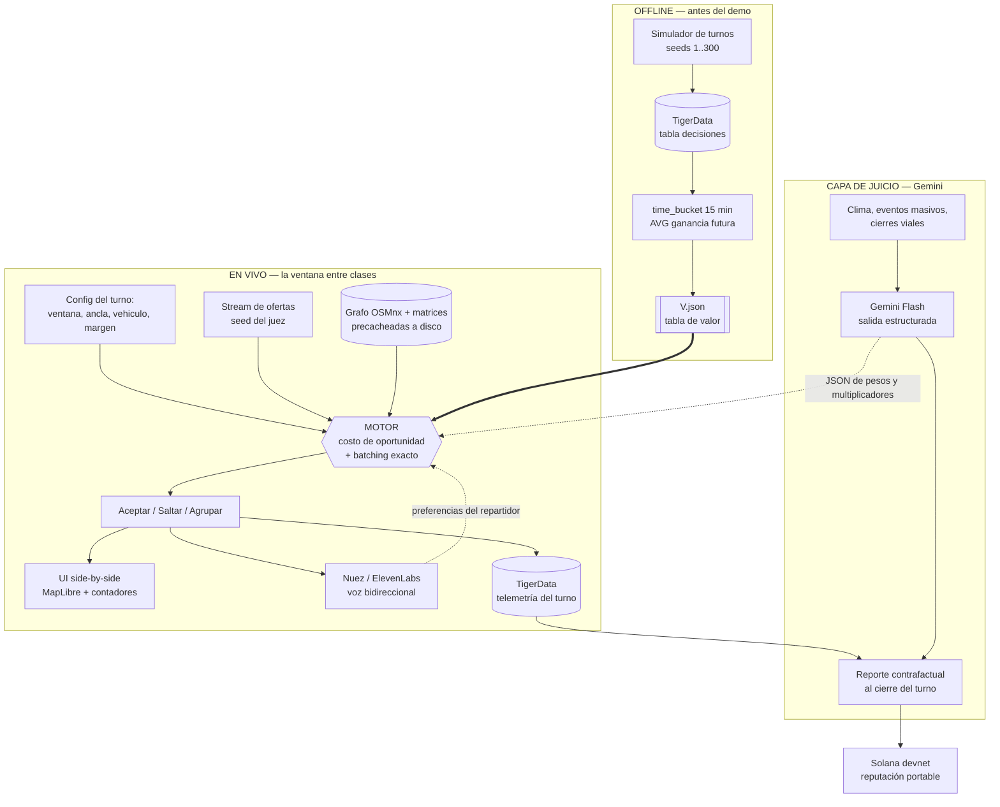
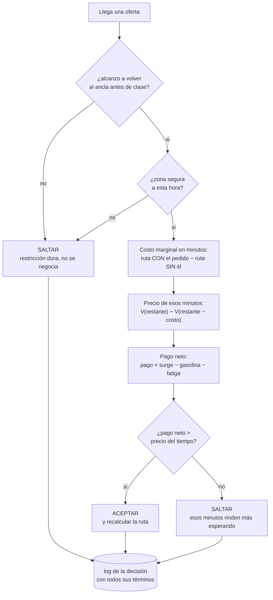

# Nuez — HackMTY 2026 / Reto Infosys "The Courier"

Documento de contexto del proyecto. Lo que decidimos, por qué, y cómo se trabaja aquí.

---

## 0. Estado actual — leer esto primero

**Última actualización: 12 de septiembre de 2026 (tarde).** Rama de trabajo: `main`.

**El proyecto en tres renglones:** un estudiante tiene una ventana libre entre clases y quiere
sacar dinero repartiendo comida. Nuestro agente decide qué aceptar y qué no, le gana a un
repartidor normal por un margen claro, y explica cada decisión en voz alta.

### El número, hoy

```
python comparar.py 200

200 turnos, seeds de REPORTE 2000-2199
                  greedy      NUEZ
  ganancia media   $200      $259
  entregas          3.2       5.1
  llegaron tarde      0         0
  DELTA: +29.2%   gana en 150/200
```

**El asterisco, y hay que decirlo en el pitch:** la trayectoria fue −1.0% → +1.8% (tráfico
direccional) → +9.0% (batching) → +11.1% (descuento de tiempo parado) → **+29.2%**. Ese último
salto **no es que Nuez mejorara** ($257 → $259, o sea nada): es que el greedy bajó de $233 a $200
al dejar de aceptar viajes que no alcanzaba a terminar. La corrección se aplicó idéntica a las dos
políticas, así que la comparación es limpia — pero el número honesto es *"el baseline ingenuo se
ve mejor en papel porque se pasa del turno; corregido eso, la diferencia real es 29%"*.

**Validación de duración variable (12 de septiembre):** se conserva el resultado de 2 horas.
Para 8 horas, moto, inicio 14:00, con `V_480.json` construido sobre TUNEO 0–299:

```
python comparar.py 200 --duracion 480

200 turnos, seeds de REPORTE 2000-2199
                  greedy      NUEZ
  ganancia media   $725     $1051
  entregas          9.9      19.4
  llegaron tarde      0         0
  DELTA: +45.0%   gana en 172/200
```

Son resultados del mundo sintético con esa configuración, no una promesa para cualquier
vehículo u horario. Las pruebas cubren además ventanas de 65 y 137 min, tres vehículos y
turnos de 8 horas desde las 8, 14 y 21 h. Verificación local: 177 tests Python pasan (1 de voz
en vivo omitido), 11 tests de front pasan, lint/formato/tipos/contrato/límite de líneas y build
en verde. El endpoint y el JSONL oficial también pasan su validador, incluido el log con los
campos de `explain_decision`. Ya corren los cinco agentes online y el `Oracle` offline con los
mismos seeds de REPORTE.

### Qué existe y qué falta

| Fase | Qué | Estado |
|---|---|---|
| **0** | El mundo y el rival | ✅ |
| **1** | **EL NÚMERO** — tabla de valor + política de Nuez | ✅ **+29.2% en seeds no vistos** |
| **1b** | Conformidad con el spec oficial de Infosys | 🟡 duración, restricciones, `/decide` + JSONL, cinco agentes online, Oracle, `explain_decision` y **modo degradado** ✅; faltan los shocks |
| **2** | Hacerlo visible — replay y pantalla partida | 🟡 los JSON grabados existen, pero **el front todavía no los reproduce** (hoy hace una carrera de rutas A→B). Brief listo en [`docs/front-turno-grabado.md`](docs/front-turno-grabado.md) |
| **3** | Hacerlo hablar — Gemini + ElevenLabs | el equipo lo trae aparte |
| **4** | Tracks baratos y ensayo | sin empezar |

---

## 0b. Handoff — cómo continuar

Esta sección es para quien retome el proyecto sin haber estado en la conversación.

### Reglas de la casa

- **Los commits los hace el usuario, no la IA.** Se dejan los cambios en el working tree y se
  reporta qué quedó listo. Nunca `git commit` ni `git push`.
- **Explicar en palabras simples.** El usuario pide contexto antes y después de escribir código.
- **Nada se mergea con CI en rojo.** Ver §13.

### El mapa de archivos

| Archivo | Qué es |
|---|---|
| `mundo.py` | Zonas de MTY, curvas de tráfico por corredor, riesgo por zona-hora. **Los números son inventados a ojo** — perilla de calibración, los locales del equipo deberían ajustarlos |
| `rutas.py` | La única puerta a preguntas de viaje. `minutos(i,j,hora)` y `km(i,j)`. Lee `data/matriz.pkl` (210 puntos) |
| `seguridad.py` | **Las cinco restricciones del spec.** El archivo que el juez va a pedir abrir |
| `seeds.py` | Los dos conjuntos de seeds, disjuntos y con nombre |
| `shocks.py` | Las cuatro disrupciones. La **física**: cuánto se estira un tramo, cuánto sube el pago, cuánto se atrasa un pedido |
| `backendruta/zonas.py` | La traducción entre zonas-entero (protocolo) y zonas-nombre (motor) |
| `contrato.py` | El formato de todo lo que viaja entre piezas. No cambia en silencio (§13) |
| `sim.py` | Generador de ofertas + reloj del turno + **política greedy (el baseline)** |
| `ruteo.py` | Orden óptimo de paradas por enumeración exacta + costo marginal |
| `valor.py` | Tabla de valor offline: `V.json` para ventanas de hasta 120 min y `V_480.json` para hasta 480 min. Admite otras calibraciones por CLI |
| `nuez.py` | **La política del agente.** Costo de oportunidad en vez de umbral fijo. Lee la `Estrategia` vigente; sin ella se comporta igual que siempre |
| `estrategia.py` | **Las tres perillas que el modelo puede mover, y hasta dónde.** `sanear` recorta lo que venga fuera de rango |
| `backendruta/strategy.py` | La capa lenta: el hilo, Gemini, el suplente y el `strategy_update` del JSONL |
| `comparar.py` | El arnés de medición. **Aquí sale EL NÚMERO** |
| `backendruta/courier_api.py` | Adaptador del protocolo: sesión, `/decide`, overrides, fechas ISO y zonas enteras |
| `backendruta/courier_format.py` | Traduce una `Decision` del motor a la respuesta del spec: razón en inglés bajo 40 palabras, `economics` y eventos del JSONL |
| `backendruta/explain.py` | **`explain_decision`.** Arma `inputs` + `alternatives_considered` al decidir, los guarda en el evento `decision` y los busca por `order_id` (en memoria o leyendo el JSONL) |
| `backendruta/event_log.py` | Escritura local del JSONL cronológico; no depende de red ni TigerData |
| `docs/front-turno-grabado.md` | Brief para el front: formato de los turnos grabados y qué construir en el mapa |
| `courier/` | El spec oficial que mandó Infosys. Material ajeno: se lee, no se toca (excluido de ruff/mypy) |

### Comandos

```bash
python comparar.py 200
```

Para evaluar jornadas largas y otros vehículos:

```bash
python comparar.py 200 --duracion 480 --hora-inicio 14 --vehiculo moto
```

`--duracion` está en minutos. La comparación conserva `V.json` para ventanas de hasta
120 min y carga `V_480.json` para las mayores, hasta 480 min. Ambas tablas predeterminadas
se calibraron con moto e inicio a las 14:00: usarlas en otra ventana, hora o vehículo es una
aproximación agregada, no una calibración específica. Para construir y usar otra:

```bash
python valor.py --duracion 480 --hora-inicio 8 --vehiculo bike --salida V_bike_8.json
python comparar.py 200 --duracion 480 --hora-inicio 8 --vehiculo bike --tabla V_bike_8.json
```

Las tablas nuevas incluyen los parámetros y seeds de TUNEO como metadatos. Un horizonte
mayor al cubierto por la tabla falla explícitamente: nunca se recorta a 120 min ni vuelve
gratis el costo de oportunidad. Se admiten duraciones que no sean múltiplos de 10.

```bash
python valor.py
```

```bash
python -m pytest
```

Los demás, cuando toquen: `python seguridad.py` corre las cinco restricciones;
`python scripts/engine_baseline.py --write` mueve el ratchet a propósito;
`python scripts/contract_codegen.py --write` tras tocar `contrato.py`;
`python data/export_turno.py` regraba los turnos que reproduce el front;
`python "courier/validate_format (2).py" --event-log mi_turno.jsonl` valida el formato;
`python -m backendruta.explain ORD-0042 --log mi_turno.jsonl` explica una decisión sin nada
corriendo (con el servidor arriba: `GET /explain/{order_id}`).

### Lo que ya se midió y NO funcionó — no repetirlo

Estos tres se probaron con medición pareada, no con intuición. Volver a intentarlos es tiempo
tirado salvo que el mundo cambie mucho:

- **Iteración de política** (construir V jugando como Nuez en vez de como el greedy): **−3.0%**.
- **Tabla de valor por zona, `V[t][zona]`**: +7.5% en unos casos, −5.9% en otros. La causa es
  **sesgo de selección**: `V[Tec]` sale inflado porque los repartidores que siguen en Tec son
  justamente los que están teniendo un buen turno. Además no hay datos suficientes en zonas raras.
- **Descuento global al costo de oportunidad**: peor en todos los niveles probados.

Lo que **sí** funcionó en su lugar: `nuez.DESCUENTO_PARADO = 0.5`. Cuando la ruta está vacía un
minuto rinde exactamente cero, así que el costo de oportunidad se parte a la mitad. Medido en 300
seeds: +$8.9 por turno ±$2.6 (3.4σ), cambia 112 de 300 turnos. Si se recalibra el mundo, hay que
volver a barrer ese parámetro **en seeds de TUNEO**.

### El bug de la hora — no revertirlo

El regreso al ancla se estimaba con la hora actual aunque se recorriera una hora después, con
otro tráfico. Por eso había turnos que llegaban tarde con la cuenta cuadrada. La corrección está
en `ruteo.duracion` y en `sim.politica_greedy`: **cada tramo se estima a SU hora**, calculada
desde el minuto absoluto del turno. El greedy además ya cuenta la espera del restaurante.

Resultado: **0 violaciones de fin de turno en 300 seeds × 3 horas de arranque, en las dos políticas.**

`mejor_ruta` y `costo_marginal` usan `duracion` con la hora de cada tramo y el vehículo.
El simulador también anticipa el salto de tráfico al cambiar de hora mientras está parado:
esperar hasta después del salto podía volver imposible el regreso (car, 8 h desde las 8,
seed 2000). La inserción de rutas grandes conserva ahora la primera parada en curso.

### Qué sigue, en orden

El spec de Infosys (`courier/`) es prescriptivo y **cumplir el formato vale más ahorita que subir
el porcentaje**: un agente brillante que no cumple el esquema pierde puntos por mecánica.

| # | Qué | Por qué |
|---|---|---|
| 1 ✅ | Separar seeds de tuneo y reporte | Sin esto, Results se topa en 3 |
| 2 ✅ | Las cinco restricciones + capacidades por vehículo | Es la mitad de Judgment |
| 3 ✅ | **Turnos de 8 horas y duración variable** | Tabla larga offline, CLI configurable, velocidad por vehículo y conversión de `shift_hours` en `/shift/start` |
| 4 ✅ | **Endpoint `/decide` + log de eventos en su JSONL** | Adaptador separado, overrides aplicados, razones inglesas bajo 40 palabras y JSONL local. Validador oficial en verde para endpoint y log |
| 5 ✅ | **Los cinco baselines + el Oracle** | `oracle.py` conoce el stream completo offline, explora agendas sin apilar y escoge el mejor resultado reproducible frente a los cinco agentes online |
| 6a ✅ | **`explain_decision`** | `GET /explain/{order_id}` (alias `/explain_decision/{order_id}`) responde en ms desde el registro; si el proceso se reinició, lee el JSONL. Nunca re-decide |
| 6b ✅ | **Modo degradado + capa de estrategia** | `backendruta/strategy.py`. Gemini corre en un hilo aparte y solo mueve tres perillas; la ruta rápida nunca lo llama. Sin credencial, `degraded: true` y sigue decidiendo. Se recupera solo |
| 7 ✅ | **Shocks** (`surge`, `closure`, `rain`, `delay`) | `shocks.py` + `POST /shock`. Física en código, juicio en Gemini. Dado aparte: el número sin shocks no se movió |
| 8 | Reproducir el turno en el front + contadores + panel de decisión | Judgment sigue en cero del lado visual. Es trabajo solo de front, sobre los JSON grabados: [`docs/front-turno-grabado.md`](docs/front-turno-grabado.md) |

### `explain_decision`: qué quedó

- **Se arma al decidir, no al preguntar.** `explain.build` usa los números que el motor ya tenía y
  los guarda en el evento `decision` del JSONL: `inputs` (posición, tiempo restante, minutos para
  terminar, oferta, límites del vehículo, estrategia activa) y `alternatives_considered`.
- **Una alternativa con números por cada tipo de decisión.** Aceptada: "SKIP and keep waiting" y
  por qué perdió. Saltada por dinero: "ACCEPT" con cuánto le faltó. Saltada por seguridad: la
  restricción con sus números (p. ej. *95 min contra el límite de 90*) **y** lo que habría dicho la
  cuenta de dinero sola: *"Pay math alone says ACCEPT, but safety constraints… cannot be bought
  with money."* Esa segunda línea es la que conviene enseñar al juez.
- **`nuez.py` guarda tres términos más** (`minutos_ruta_actual`, `minutos_para_terminar`,
  `minutos_de_turno`) para mostrar la cuenta del fin de turno. No cambian ninguna decisión: el
  ratchet sigue igual.
- **Razón de `/decide` sin contradicciones al redondear.** Antes decía *"MXN 26 net is below the
  MXN 26…"*, y a veces el pedido pagaba **más** que el costo: lo rechazaba el margen mínimo
  `nuez.MARGEN` ($1), que la frase no mencionaba. Ahora va con un decimal y nombra ese margen.
- **Tests:** `tests/test_explain.py`.

### La capa de estrategia y el modo degradado: qué quedó

**La regla que lo explica todo:** Gemini **nunca decide un pedido**. Solo mueve perillas, y el
motor las lee de memoria entre pings.

```
ping  ->  motor  ->  lee capa.actual  ->  responde      microsegundos, tier1
          hilo   ->  llama a Gemini   ->  reemplaza     cada 5 min, aparte
```

Esto es literalmente la regla del spec: *"any code path that calls a model inside the decision
window fails Feasibility"*. Varios equipos van a poner el LLM en medio y ahí se caen.

**Las tres perillas** (`estrategia.py`), y ninguna es de seguridad:

| Perilla | Qué hace | Rango duro |
|---|---|---|
| `margen_mxn` | qué tan exigente es con el dinero | 0 – 40 |
| `descuento_parado` | cuánto vale un minuto estando quieto | 0.1 – 1.0 |
| `multiplicador_zona` | encarece el tiempo hacia una zona (lluvia, cierre, concierto) | 0.5 – 3.0 |

Las cinco restricciones duras viven en `seguridad.py` y **ningún modelo las alcanza**. Si Gemini
dijera *"métete a Escobedo a las 11 PM que pagan bien"*, el motor dice que no igual: el dinero ni
siquiera entra a esa función. Hay un test que falla si aparece una perilla nueva sin revisarla.

**`sanear` recorta en vez de creer.** Un modelo puede alucinar, venir envenenado por un prompt
metido en un nombre de calle, o equivocarse de unidades. Un `margen_mxn` de $9999 apagaría al
repartidor; los rangos de arriba lo dejan en 40 antes de que llegue al motor. Una zona inventada
se ignora: el modelo no puede crear geografía.

**El seguro del número:** `BASE` son los valores de hoy. Mientras nadie actualice la estrategia,
el agente se comporta idéntico a cuando se midió el +29.2%, y el ratchet lo confirma byte a byte.

**La credencial se lee de `os.environ` en cada llamada**, a propósito. Los jueces la invalidan en
el entorno del proceso; un cliente creado al arrancar con la llave guardada en memoria nunca se
enteraría y no habría degradado que enseñar. Es una línea y es un punto del puntaje.

**Variables de entorno:**

| | |
|---|---|
| `GEMINI_API_KEY` | sin ella, el sistema arranca degradado (que es la verdad: no hay modelo) |
| `GEMINI_MODELO` | por omisión `gemini-2.0-flash` |
| `NUEZ_MODELO=falso` | usa el suplente local, para trabajar sin credencial. Devuelve los valores BASE: no cambia ninguna decisión |

**El suplente NO reemplaza a Gemini en el demo.** Es andamio para trabajar sin llave y el doble
que usan los tests: en CI no hay red ni credencial, y no se le puede pedir a Google que se ponga
lento a la orden. El ensayo del degradado sí se hace con Gemini real, borrando la variable.

**Tests:** `tests/test_estrategia.py`. Los tres momentos que el juez provoca — el modelo tarda y
`/decide` responde igual, le quitan la llave y sale `degraded: true`, se la devuelven y se
recupera — más los rangos y el guardia de las perillas.

**Lo que queda del 6b:** ensayarlo con la credencial puesta, y decidir si Gemini además narra la
decisión en voz alta (eso es la capa de voz, no ésta).

### Los shocks: física contra juicio

Los cuatro tipos hacen dos cosas distintas y **mezclarlas sería el error**:

| | **Física** — `shocks.py`, en código | **Juicio** — la capa de Gemini |
|---|---|---|
| `surge` | el pago en esa zona sube ×mult | ¿vale la pena ir? |
| `closure` | los tramos que tocan esa zona ×2.2 | ¿evitarla del todo? |
| `rain` | toda la ciudad ×1.35 | ¿subir el margen? |
| `delay` | ese pedido queda listo N min después | — puro tiempo |

Si cerraron una avenida, el viaje tarda más **aunque el modelo esté caído**. Un cierre no es una
opinión. Por eso la física vive en la ruta rápida y determinista, y Gemini solo mueve las ganas
(`estrategia.multiplicador_zona`).

**`Activos` es una foto inmutable que se pasa como argumento**, nunca una global. Una variable
global "está lloviendo" rompe el replay: el orden en que cada quien la lea cambia el resultado y no
queda en el log. Como argumento es un dato más de la decisión y se audita.

**Tres caminos, la misma capa:**

```bash
python comparar.py 200 --shocks     # el renglón medido
POST /shock                          # el botón del juez
```

El replay sale de los eventos `shock` del JSONL.

**El dado es aparte.** `shocks.generar` usa `Random(seed ^ SAL)`, no el de las ofertas. El stream
de ofertas depende solo de `cfg.seed` y se escribe completo antes de que el agente decida nada, así
que queda byte por byte idéntico: el número sin shocks no se mueve. Hay un test que lo fija.

### Lo que salió de medir con disrupciones

```
python comparar.py 200            greedy $200   NUEZ $259   +29.1%   0 tarde
python comparar.py 200 --shocks   greedy $189   NUEZ $247   +30.6%   4 y 6 tarde
```

Los dos bajan, que es lo esperado: el mundo se puso más difícil. La diferencia entre columnas
aguanta.

**Pero hay violaciones, y hay que decirlo.** 6 de 200 turnos no vuelven a tiempo con disrupciones.
En 5 de esos 6 el motor **sí detectó** que ya no alcanzaba y no pudo hacer nada: traía todo
recogido. Un repartidor puede cancelar lo que no ha recogido; no puede tirar comida que ya carga.

Lo que sí se implementó: **cancelar lo que todavía no se recoge**. Cada minuto se reproyecta la
ruta con las condiciones de ahora, y si ya no cabe en el turno se sueltan los pedidos pendientes
de recoger, del último al primero, hasta que vuelva a caber (`Resultado.cancelados`).

**Lo que se probó y NO sirvió:** escalar el colchón de fin de turno con la severidad de la
disrupción activa. Medido, 6 tarde → 7, y cuesta ~$2 por turno. El problema no es el margen al
aceptar: es que el shock llega **después** de comprometerse. Revertido.

**Dos bugs que salieron de este trabajo**, los dos en el chequeo de factibilidad:

1. Recalculaba el tramo en curso **completo desde el origen** cada minuto, sumando un minuto de
   castigo por cada minuto en tránsito. Ahora arranca desde `t_llegada` en la primera parada.
2. Usaba **una sola hora** para toda la ruta mientras la política estima cada tramo a la suya.

El segundo movió el ratchet a propósito: **23.596 → 23.336** sin shocks. Son 0.26 puntos a cambio
de que un turno que se pasaba del margen de 10 minutos ya no se pase. El margen ES la restricción
de fin de turno: bustearlo era violar nuestra propia regla.

**Hueco conocido:** `Resultado.llego_tarde` mide llegar después de que acaba el turno, no después
del margen. Un turno puede bustear el colchón de 10 min y salir reportado como puntual. Al decir
"cero violaciones" conviene ser preciso sobre cuál de las dos cosas se midió.

### Detalles del spec que se olvidan fácil

- **50 ms de presupuesto** en la ruta rápida. Nuestro motor tarda microsegundos, así que esto
  juega a favor — pero **ningún código que llame a un modelo puede estar dentro de la ventana de
  decisión**, o reprueba Feasibility. Varios equipos van a caer ahí.
- **`courier_state_overrides`**: los jueces inyectan estado antes de un ping (minutos manejando,
  horas de turno transcurridas, pedidos en vuelo, hora de fin). Hay que respetarlo, no ignorarlo.
- **Replay determinista**: graban un turno, lo reproducen y comparan decisión por decisión.
- **Razón bajo 40 palabras** que nombre la restricción que de verdad mandó. Una decisión correcta
  con razón genérica **no** gana el crédito de Judgment.
- **"Una restricción que existe en el código pero nunca se ve activarse califica bajo — ensaya al
  menos dos como momentos en vivo."** O sea: hay que *provocar* la regla del calor y la del
  descanso frente al juez, no solo tenerlas.
- **Responder desde el log en menos de 10 segundos** es en sí mismo parte del puntaje. Re-derivarlo
  en vivo es la respuesta equivocada aunque salga bien. Ya cubierto por `backendruta/explain.py`.

### Pendientes chicos pero que se notan

- **Los turnos grabados son de TUNEO** (1, 7 y 42), y el del seed 1 quedó feo: el greedy hace $66
  y 1 entrega. Es el golden de regresión, por eso no se cambió, pero **para el demo hay que
  escoger otros seeds, y de REPORTE**. Se regraban con `python data/export_turno.py 1 2000 2001 2002`.
  Incluir el `1`: `turnos.json` se reescribe solo con los seeds que se pasen.
- **La varianza por turno es enorme** (desviación ~56 puntos porcentuales; el peor turno −83%, el
  mejor +252%). **Un turno animado no es evidencia.** Hay que mostrar la distribución de 50 turnos
  al lado del turno bonito, o el juez tiene razón en no creernos.
- **El front comía ~3 GB de RAM.** La medición es anterior a la carga de calles por zona
  (`frontend/src/map/roads.ts`): el patrón `_roadFeatures.concat` que se citaba como causa ya no
  aparece en `src/`. **Medir de nuevo antes de invertirle tiempo.** Si sigue alto, la palanca más
  barata es `INCLUIR_LOCALES = False` en `data/export_geojson.py`.
- **La UI actual usa emoji como íconos** (🤖 🧠 ⚔️ 📍 👁️), que `docs/ui-style-guide.md` prohíbe.

---

## 1. El reto

> Dado un flujo de ofertas de entrega, tráfico y un turno limitado, ¿puede un agente de IA
> ganar lo máximo para un repartidor, como lo haría un conductor experimentado?

**Criterios de evaluación (solo dos):**

| Criterio | Qué miden |
|---|---|
| **Results** | En un turno fresco que no vimos, cuánto gana el agente vs un baseline simple |
| **Judgment** | ¿Toma decisiones seguras y sensatas bajo surge/tráfico, y puede explicárselas a un juez? |

**Lectura estratégica:** la mitad del puntaje no es el algoritmo, es que el agente
**sepa defender su decisión**. Casi todos los equipos van a construir un optimizador y una
gráfica. Gana el que construya un optimizador **que hable**.

Entregable pedido explícitamente por el reto: código funcionando + demo en vivo donde
**dos agentes corren el mismo turno fresco lado a lado**, con un contador de ganancias
corriendo, y un **surge o un cierre vial** a mitad del turno al que deben reaccionar.

---

## 2. La idea

**Nuez** — el copiloto del repartidor estudiante. Un agente que corre tu ventana libre entre
clases y te dice al oído, en voz alta, qué aceptar y por qué.

**Idioma (decidido):** la UI y la voz van en **inglés**. Es la condición del reto extra de
ElevenLabs (voces en inglés, después comandos de voz para no tocar la pantalla caliente).
El código, los comentarios y este documento siguen en español.

```
[ping] "Rappi, Contry a San Pedro, $48."
Nuez: "Salta. Son 22 minutos contra tráfico y no alcanzas a volver
       para tu clase de las 4. En 6 minutos entra el surge aquí cerca."
```

Un repartidor en moto a 40°C **no lee una pantalla**. La voz no es un add-on para ganar un
track: es la única UI honesta para este caso de uso.

**Frase de pitch:** *no optimizamos las entregas de la plataforma, optimizamos el ingreso del
repartidor — y le explicamos cada decisión en voz alta, porque él es el que va manejando.*

### Enfoque estudiantil (input de la sesión con Infosys)

El usuario no es un repartidor de tiempo completo: es un universitario con **dos horas libres
entre clases** que quiere sacar dinero sin alejarse del campus.

En dos horas, perder 40 minutos consume un tercio de la ventana; por eso elegir bien y volver
a clase importa tanto para el estudiante. **No asumimos que un turno corto produce mayor
ventaja porcentual:** se mide por duración. Hoy el resultado de 8 horas supera al de 2 horas
en el mundo sintético (ver §0).

Y el demo le pega mucho más a jueces que están parados en un campus.

### Configuración antes del turno

| Input | Efecto |
|---|---|
| Ventana horaria (ej. hoy 14:00–16:00) | Duración del turno → `V[t]` arranca en t=120, no 480 |
| Ancla (campus, biblioteca, casa) | Restricción de regreso factible |
| Margen de seguridad (default 10 min) | Colchón antes de que empiece la clase |
| Vehículo (`moto` / `car` / `bike`) | Velocidad, gasolina y **límites de peso, volumen y nº de pedidos** (`seguridad.VEHICULOS`). Los tres los exige el spec |

### La restricción de distancia NO es un radio

El instinto es "geocerca de 3 km alrededor de la uni". **Está mal:** un pedido que te aleja 3 km
en el minuto 20 es perfecto; el mismo en el minuto 100 te deja sin llegar a clase.

Lo correcto es **regreso factible**, como filtro duro junto al de seguridad:

```
aceptar  <=>  t_recoger + t_entregar + t_regreso_al_ancla(destino) <= t_restante − margen
```

**Comportamiento emergente:** conforme se acaba la ventana, el conjunto de pedidos válidos se
encoge hacia el campus. El agente "se va regresando" solo, sin que nadie lo programe — igual que
el pedido de $90 que cambia de malo a bueno. Dos emergencias explicables en una frase cada una,
ambas en el mismo demo.

No requiere motor nuevo: `V[tiempo][zona]` ya existe, esto es un filtro encima.

### La mascota: Nuez, y no es decoración

**El algoritmo ya es teoría de forrajeo óptimo.** El teorema del valor marginal de Charnov (1976)
—cuándo abandonar un parche de comida— dice exactamente lo que dice nuestro motor: *te vas cuando
el rendimiento local cae por debajo del promedio del ambiente*. Es la misma matemática, publicada
estudiando animales que juntan comida.

El animal del ejemplo clásico —el que junta, hace caché y **siempre regresa a su árbol**— es la
ardilla. Que además es la mascota no oficial del campus del Tec.

| | |
|---|---|
| **Nombre** | Nuez — es de aquí, es corta, es marca |
| **Mascota** | Ardilla regia con casco de moto |
| **Promesa** | "Junta más nueces entre clases" |
| **La voz** | La mascota **es** ElevenLabs. Nuez es quien te habla |

Eso amarra todo: mascota, voz y explicabilidad dejan de ser tres cosas y son una. Si un juez
pregunta por qué una ardilla: *"porque el algoritmo es literalmente forrajeo óptimo, y las
ardillas siempre vuelven a su árbol — como tú a tu clase de las 4."*

**Timebox del branding: 3 horas, una persona, en paralelo.** Nombre, un SVG, paleta, y el prompt
de personalidad de la voz. **NO:** personaje 3D, animaciones, landing, deck de 20 slides.
Si a la hora 10 no corre el baseline, la ardilla no nos salva.

### Encuadre de startup

El lado del trabajador en la economía gig: las plataformas optimizan sus entregas, nadie optimiza
tu ingreso por hora. Primer mercado: ~200k universitarios del área metropolitana que ya manejan
para Uber/Rappi/DiDi entre clases.

Con este encuadre **Solana deja de estar pegado con cinta**: la reputación portable entre
plataformas es producto, no track.

---

## 3. Arquitectura: dos capas

**Regla de oro: el LLM NUNCA hace las matemáticas.** Ese es el error que mata hackathons —
el LLM alucina un número, pierdes contra el baseline y no hay demo.

| Capa | Qué hace | Con qué |
|---|---|---|
| **Motor** (determinista) | Acepta/rechaza, agrupa, rutea. **Gana el dinero.** | Tabla de valor + enumeración exacta |
| **Juicio** (Gemini) | Explica, maneja excepciones, ajusta pesos de la política | Gemini Flash, salida estructurada |

Gemini **no elige la orden**. Gemini decide cosas como *"cerraron Constitución → sube la
penalización de cruce de río durante 20 min"* y emite el JSON con el que el motor recalcula.
Determinista, auditable, sin alucinación de dinero.

### Diagrama



**Lo que el diagrama tiene que dejar claro:** la flecha gruesa (`V.json → MOTOR`) es de disco, no
de red. Gemini y el mundo exterior solo entran por líneas punteadas — **ajustan pesos, nunca
deciden dinero**. Si Gemini se cae a media demo, el agente sigue corriendo.

---

## 4. El motor: costo de oportunidad

### La intuición

**El turno no es una lista de pedidos. Es un presupuesto de minutos.** Cada pedido que aceptas
es una compra: pagas minutos, recibes pesos.

La pregunta no es *"¿este pedido paga bien?"* sino
**"¿este pedido paga mejor de lo que normalmente rinden esos minutos?"**

### Paso 1: la tabla de valor (offline, una vez)

Corres el simulador ~300 veces con el baseline greedy. En cada momento del turno anotas
cuánto dinero **faltaba por ganar de ahí en adelante**. Promedias.

| Minutos restantes | Ganancia esperada de aquí al final |
|---|---|
| 480 (turno completo) | $900 |
| 420 | $790 |
| 300 | $560 |
| 120 | $210 |
| 60 | $95 |
| 30 | $40 |
| 0 | $0 |

Son ~32 números en un JSON. No es un modelo, no hay entrenamiento.
Versión refinada: `V[minutos_restantes][zona]` — terminar en San Pedro no vale lo mismo que
terminar en Escobedo. Sigue siendo promediar.

### Paso 2: la decisión (en vivo, microsegundos)

```
Quedan 480 min. Pedido: paga $120, cuesta 60 min.
  V(480) = $900,  V(420) = $790  ->  esos 60 min rinden $110 normalmente.
  $120 > $110  ->  ACEPTAR (ganas $10 sobre tu promedio)

Mismo momento. Pedido: paga $90, cuesta 60 min.
  $90 < $110  ->  SALTAR
```

### El flujo completo de una oferta



El log de cada decisión guarda **todos los términos**, no solo el resultado. De ahí salen las
tres cosas que importan: lo que dice la voz, el reporte contrafactual, y la respuesta cuando un
juez pregunta "¿por qué?".

### La parte bonita (va en el demo)

Quedan **30 minutos** → la tabla dice que valen **$40**. Llega el mismo pedido de $90 que
rechazó en la mañana... **y ahora lo acepta**.

> **El mismo pedido es malo a las 10 AM y bueno a las 9 PM.**

Es exactamente lo que hace un repartidor con años de experiencia: temprano es exigente porque
sabe que va a llegar algo mejor; al final agarra lo que sea. **El agente hace eso solo**, nadie
lo programó como regla — sale de la aritmética. Y cuando el juez pregunte por qué, la respuesta
es una oración: *"porque a esa hora sus minutos valían $110 y el pedido pagaba $90."*

### Nombre técnico honesto

Si un juez pregunta dónde está el ML: **evaluación Monte Carlo de la política, aprendizaje por
refuerzo sin modelo** (Sutton & Barto, cap. 5). No es marketing — construir una función de valor
promediando retornos de episodios es literalmente eso. Está implementado en forma tabular, que
es la que se puede auditar.

### Dónde NO meter ML

- Predecir demanda por zona → promedio histórico por hora del día
- Predecir tiempos de viaje → OSMnx ya los da, con factor de tráfico por hora
- Predecir surge → **lo generamos nosotros en el simulador**, no se predice lo que uno escribió

Nadie pierde este hackathon por no tener ML. Varios lo van a perder por entrenar algo que un
`statistics.mean` resolvía.

---

## 5. Batching y ruteo

La única pregunta que importa, y la que alimenta la tabla:

```python
costo_marginal = dur(mejor_ruta(paradas + nuevo)) - dur(mejor_ruta(paradas))
```

*"¿Cuántos minutos EXTRA me cuesta meter este pedido a lo que ya traigo?"*

Si ya vas al norte y el nuevo va de paso, el costo real es 12 min, no 60. Comparas **12** contra
la tabla y el pedido que se veía malo resulta excelente.

**Implementación por defecto: enumeración exacta.** Un repartidor carga 2–4 pedidos = 4–8
paradas. Con precedencia (recoger antes de entregar) son ~2,520 rutas válidas para 4 pedidos →
milisegundos, y es **óptimo exacto**, no heurístico.

```python
from itertools import permutations


def mejor_ruta(paradas, t):
    def valida(orden):
        vistos = set()
        for tipo, oid in orden:
            if tipo == "dropoff" and oid not in vistos:
                return False
            vistos.add(oid)
        return True

    return min((p for p in permutations(paradas) if valida(p)), key=lambda p: duracion(p, t))
```

**Rol acotado de OR-Tools:** solver de respaldo cuando la mochila pasa de 5 pedidos (>10
paradas), donde la enumeración deja de ser instantánea. Misma firma, se activa por umbral.
No se usa en ninguna otra parte del proyecto.

```python
def mejor_ruta(paradas, t):
    return _enumerar(paradas, t) if len(paradas) <= 10 else _ortools(paradas, t)
```

**Ruteo:** OSMnx/OSRM da el camino más rápido. No se decide nada ahí, solo se consulta.

---

## 6. Factores humanos

Es donde se gana **Judgment**. Trampa a evitar: si metes 15 factores, queda una sopa que nadie
puede explicar — y explicar es la mitad del puntaje.

**Regla: una sola función de utilidad, pocos términos, todos visibles en pantalla.** Si el juez
pregunta "¿por qué rechazó esa?", la UI debe poder señalar el término que mandó.

```
valor = pago × surge
      − costo_tiempo(tráfico, clima)
      − costo_gasolina
      − fatiga(horas, calor)
      − costo_oportunidad(dónde te deja)

sujeto a:   zona_riesgo(hora) < umbral                    <- RESTRICCIÓN DURA
            t_pedido + t_regreso_ancla <= t_restante − margen   <- RESTRICCIÓN DURA
```

Las dos restricciones duras son del mismo tipo y por la misma razón: **no se compran con dinero.**
Ninguna cantidad te manda a una zona insegura a las 11 PM, y ninguna cantidad te hace llegar
tarde a tu clase.

### Seguridad = restricción, no precio

Si la seguridad es un término que se resta, el agente **la vende**: con suficiente dinero entra
a cualquier lado. Como restricción dura, el agente dice:

> *"Rechacé esa de $210. No es por el dinero — a las 11 PM no te mando a esa colonia. Punto."*

Dicho en voz alta frente a un juez, eso vale más que $300 extra en el contador.

**Honestidad de datos:** no hay datos abiertos y confiables de criminalidad por colonia-hora en
Monterrey. Construimos una capa de riesgo curada (iluminación, tipo de vialidad, hora, densidad)
y **lo decimos en el pitch**: *"esta capa es sintética; en producción se alimenta de X e Y."*
Los jueces castigan el dato inventado y premian la honestidad metodológica.

### Las cinco restricciones del spec — `seguridad.py`

El protocolo oficial (`courier/evaluation_protocol.md`) no deja las restricciones a criterio: son
cinco, con nombre, y **tienen que estar en código, no en el prompt de un modelo**. El juez va a
pedir abrir el archivo donde está cada límite. Ese archivo es `seguridad.py`, y las dos políticas
(baseline y Nuez) entran por la misma función `revisar()` — un baseline que atropella
restricciones no sería comparable.

| `binding_constraint` | Límite | Dónde muerde |
|---|---|---|
| `flagged_zone_night` | zona marcada después de las 22:00 | `mundo.es_segura` — línea de reloj, no de promedio |
| `mandatory_break` | 20 min de descanso tras 4 h continuas | turnos largos |
| `heat_rule` | máx 90 min continuos entre 12:00 y 16:00 | el turno de la tarde, casi siempre |
| `shift_end_infeasible` | no aceptar lo que no se termina a tiempo | el final del turno |
| `vehicle_capacity` | peso, volumen y pedidos por vehículo | los paquetes en bici |

`reservation_wage` es el sexto valor del enum y **no** es de seguridad: es el costo de oportunidad,
lo único que sí se compra con dinero.

**El descanso no es una máquina de estados.** El simulador lleva un contador de minutos continuos
con trabajo encima; 20 minutos parado lo resetean. Como la política rechaza todo mientras el límite
esté alcanzado, el repartidor se queda quieto y el descanso se toma solo.

**Se tienen que ver disparándose.** El spec es explícito: *"a constraint that exists in code but is
never demonstrated triggering scores low"*. `tests/test_sim.py` falla si alguna de las seis deja de
aparecer en corridas reales — si una se vuelve inalcanzable es tan malo como no tenerla.

### Seeds de tuneo y de reporte — `seeds.py`

*"If your reported numbers come from the seeds you tuned on, Results caps at 3."* Los dos conjuntos
son disjuntos y tienen nombre: **TUNEO 0–1999** (tabla de valor, barridos de parámetros) y
**REPORTE 2000+** (el único número que se dice en voz alta). `comparar.py` revienta con un assert
si alguien reporta sobre un seed de tuneo.

---

### Clima y eventos

Un evento masivo **no es solo más demanda, es una trampa**: sube el pago y te deja atorado 40
minutos. El agente que sabe **posicionarse en el borde, no en el centro** es el que "piensa como
un repartidor con experiencia" — que es textualmente lo que pide el reto.

Fuentes:
- **Clima:** Open-Meteo (sin API key, histórico + forecast). Lluvia = surge real y riesgo real.
- **Eventos:** lista curada a mano de 10–15 (Arena Monterrey, Estadio BBVA, Auditorio Pabellón M,
  Parque Fundidora). Con eso basta para el demo.
- **Calor:** el reto lo menciona explícito ("40-degree heat"). Fatiga por calor acumulado es un
  término que nadie más va a tener y es puro driver-side.

---

## 7. Tracks adicionales

### Gemini — capa de juicio + reporte contrafactual

1. **Texto desestructurado del mundo real → multiplicadores de demanda.** Esto es lo que un
   heurístico no puede hacer y un LLM sí. Es el argumento del track.

   ```json
   {"zona": "Fundidora/Obispado", "ventana": "18:00-20:30",
    "demanda": 2.4, "movilidad": 0.5,
    "razon": "salida masiva bloquea Av. Madero; entrar antes de las 18:00 o no entrar"}
   ```

2. **Reporte contrafactual al cierre del turno:** *"rechacé 34 órdenes; de haberlas tomado
   habrías ganado $180 menos."* Los jueces aman el contrafactual: es la prueba de que el agente
   pensó, no de que tuvo suerte.

3. **Multimodal (bonus):** leer el screenshot del ping de la app, como lo lee el humano — así no
   asumimos una API que no existe.

### ElevenLabs — manos libres bidireccional

No es TTS decorativo. El repartidor **contesta**: *"no, esa colonia no"* → el agente aprende esa
preferencia y la mete en la función objetivo. Voz como canal de **entrada**, no solo de salida.
Streaming de baja latencia para que se sienta vivo. Que suene a norteño, no a locutor de
aeropuerto.

**Estado (implementado):** paquete `voz/` + rutas `/api/voice/*` en el backend + helper
`frontend/src/voice/nuez.ts`. Va directo al REST de ElevenLabs con httpx (el SDK no instala en
Windows por rutas largas). Voz y modelo en `voz/config.py` (o `.env`: `NUEZ_VOICE_ID`,
`NUEZ_TTS_MODEL`). **Cache en disco obligatoria** (`cache/voz/`): la cuenta es free, 10k
caracteres en total, y el wifi falla en el pitch. Antes del demo:
`python -m voz precache frases.txt`. Los tests simulan la API; `NUEZ_VOZ_LIVE=1` para pegarle
de verdad. La primera `say()` del front debe salir de un click (autoplay) o llamar `unlock()`.

### TigerData (Timescale) — el store operacional

Postgres con series de tiempo. El proyecto **es** una serie de tiempo: eventos del turno,
decisiones, ganancia acumulada, surge por hora y zona. `time_bucket('15 minutes')` es
literalmente la cubeta que ya diseñamos — el fit no está forzado.

```sql
-- La tabla de valor, mantenida sola conforme corre el simulador.
CREATE MATERIALIZED VIEW valor_por_cubeta
WITH (timescaledb.continuous) AS
SELECT time_bucket('15 minutes', t_restante) AS cubeta,
       zona,
       AVG(ganancia_futura) AS valor_esperado
FROM decisiones
GROUP BY 1, 2;
```

**Base única del proyecto.** Es Postgres: ya la necesitamos para el estado del demo, no es una
pieza añadida. Corre local en Docker, latencia de milisegundos, sin cuenta ni red.
Costo: ~2h.

**Relación con Snowflake:** hacen el mismo trabajo. Montar las dos es dos bases para una sola
tarea. Si se quieren ambos tracks, el único reparto honesto es:

| | Rol |
|---|---|
| **TigerData** | Operacional / en vivo — telemetría del turno, contadores del demo, agregados incrementales |
| **Snowflake** | Batch / offline — corpus de 300+ corridas, barridos de parámetros, contrafactual |

Cuesta ~3h extra. Solo si alguien queda libre después de la hora 24.

### Vultr — deploy y control de la caja del demo

Un VM + `docker compose` (app + Timescale). **~1 hora**, y resuelve un problema que ya
teníamos: control total del entorno del demo, todo precacheado, sin depender del wifi.

Si se toma Vultr, **Cloud Run sale del stack**. Una sola caja. Y siempre con el fallback de
correr todo en localhost por si el server falla a media presentación.

No pelea con el track de Gemini (ese es por uso de la API, no por hosting).
**No usar Vultr Cloud Inference** — competiría contra nuestro propio track de Gemini.

### Snowflake — la función de valor ES una query

No es analítica de adorno: **la tabla de valor del agente es un `GROUP BY`.**

```sql
-- Esto es el cerebro del agente, calculado en Snowflake.
SELECT
    FLOOR(minutos_restantes / 15) * 15  AS cubeta,
    zona,
    AVG(ganancia_futura)                AS valor_esperado,
    COUNT(*)                            AS n
FROM decisiones
GROUP BY 1, 2
```

300 corridas × ~200 decisiones = ~60k filas; con barrido de parámetros (umbral de riesgo, peso
de fatiga, tamaño de mochila) llega a millones. Eso ya es un dataset analítico real.

**Pitch del track:** *"Snowflake no guarda nuestros logs — Snowflake calcula la política.
La función de valor del agente es una consulta."*

Usos adicionales, gratis:
- **Barrido de parámetros:** "¿qué umbral de riesgo maximiza ingreso sin cruzar zona roja?"
  → una query con `GROUP BY parametro`, no 40 corridas manuales.
- **Contrafactual del cierre:** las órdenes rechazadas y cuánto habrían rendido → query, y su
  resultado es lo que narra Gemini.
- **Marketplace:** revisar listings gratuitos de clima antes de casarse con Open-Meteo.

**Regla que no se rompe: Snowflake nunca toca el loop de decisión en vivo.** Un round-trip de
300 ms en el momento del ping arruina el demo y mete un punto de falla con el wifi.

```
Offline (antes del demo):  simulador -> Snowflake -> query -> V.json
En vivo:                   el agente lee V.json de disco
```

Es honesto y es como se hace en producción: entrenamiento en Snowflake, inferencia local.
**Costo: ~3 horas** (`write_pandas`, una query, exportar JSON). **No usar Cortex** — compite con
nuestro propio track de Gemini y diluye los dos.

### Solana — reputación portable

Ángulo honesto que resuelve un dolor real: un repartidor con 3,000 entregas en Rappi vale **cero**
el día que se cambia a DiDi — arranca de nuevo. Registro on-chain de entregas completadas
(firmado, sin PII) = un CV que el trabajador **sí posee**. Más pago instantáneo por entrega
(Solana Pay) en vez de esperar el corte semanal.

Encaja con el "fair, driver-side optimization" que el reto plantea.
**Devnet, ~150 líneas, timeboxed.** Si Solana se come el sábado, perdimos el track principal.

### Prioridad entre tracks

Perseguir los cuatro es como se pierde el principal. Orden por retorno:

| | Track | Costo | Veredicto |
|---|---|---|---|
| 1 | **Gemini** | — | Carga producto: juicio + contrafactual |
| 2 | **ElevenLabs** | — | Carga producto: es la UI |
| 3 | **Vultr** | ~1h | Tomarlo. Es el deploy que ya íbamos a hacer |
| 4 | **TigerData** | ~2h | Tomarlo. Es la base que ya íbamos a necesitar |
| 5 | **Snowflake** | ~3h | Solo si sobra gente. Duplica a TigerData |
| 6 | **Solana** | ~4h | El más pegado con cinta. Primero que se corta |

Vultr + TigerData no son add-ons: **son nuestra infraestructura**. Salen más baratos que
Snowflake + Solana juntos y se ven menos oportunistas ante un juez — huele a cazador de tracks
y eso sí resta.

---

## 8. Stack

```
Simulador + Agente   ->  Python, un solo proceso
Store                ->  TigerData / TimescaleDB (Postgres) en Docker
API / eventos vivos  ->  FastAPI + WebSocket
Front del demo       ->  React 19 + Vite + TypeScript + MapLibre GL (frontend/)
Deploy               ->  Vultr: un VM + docker compose (fallback: localhost)
```

**Laravel queda fuera.** Es nuestra zona de confort y por eso es la trampa: no hay CRUD, no hay
auth, no hay admin. Meter PHP obliga a un puente PHP↔Python para las matemáticas. Si alguien
insiste, que haga la landing del proyecto.

**Por qué NO funciones serverless:** el simulador tiene **estado y un reloj corriendo** — un
turno es una máquina de estados de 8 horas simuladas. Partirlo en funciones sin estado cuesta un
Redis, un orquestador y seis horas de debugging por un cold start que arruina el demo en vivo.
Queremos un contenedor con un proceso que recuerda. Cloud Run servía; un VM de Vultr sirve igual,
cuesta lo mismo de montar y además gana track y da control total de la caja del demo.

**Dependencias (mínimas):**

| Paquete | Para qué |
|---|---|
| `osmnx` | Grafo de Monterrey + tiempos de viaje |
| `fastapi` + `websockets` | Stream al front |
| `ortools` | Solo el fallback de ruteo con >10 paradas |
| `psycopg` | TigerData/Timescale — store operacional y agregados |
| `snowflake-connector-python[pandas]` | Opcional: batch offline si se toma también ese track |
| `google-genai` | Capa de juicio |
| `elevenlabs` | Voz bidireccional |
| `solders` / `solana-py` | Devnet |

---

## 8b. Sistema visual del front

Tokens en `frontend/src/index.css` (`:root`). Vienen de `DESIGN.md` (paleta "Cupertino
Telemetry"). **El layout existente no se rediseña**: se restyla lo que ya hay.

| Token | Valor | Para qué |
|---|---|---|
| Canvas | `#FAF6F3` | Fondo de la app, cálido y mate. Tema claro, no oscuro |
| Tinta | `#18151A` / `#3E3D41` / `#807479` | Texto en tres niveles |
| Ciruela | `#684959` | **La marca.** Botón primario, marcador del repartidor, acentos |
| Esmeralda | `#10B981` | **Solo dinero y turno activo**: contador de ganancias, entregas |
| Ámbar | `#F59E0B` | **Solo urgencia**: surge, zona congestionada, tiempo por vencer |
| Índigo | `#4F46E5` | **Solo el algoritmo**: ruta, geocerca de regreso factible, decisión |
| Hairline | `#D8CCCA` | Bordes de 1px. Sombras teñidas de ciruela, nunca negro puro |

- **Tipografía:** Outfit (Google Fonts), una sola familia. Números que cambian en vivo con
  cifras tabulares (`.num`). Etiquetas pequeñas en mayúsculas con tracking 0.15em (`.caps`).
- **Forma:** tarjetas 16px, paneles 24px, botones y chips píldora. Botones de 44px mínimo.
- **Mapa:** claro. Calles blancas sobre canvas, autopistas en amarillo suave con borde. Las
  zonas llevan **un** tono (ciruela) y ámbar solo si son inseguras de noche: el color significa
  algo o no se usa. Ruta en índigo con borde blanco, sin glow.

**La guía completa, con lo prohibido y el checklist antes de cerrar un cambio de UI, está en
[`docs/ui-style-guide.md`](docs/ui-style-guide.md). Se lee antes de tocar `frontend/`.**

---

## 9. El demo (aquí se gana o se pierde)

El reto dicta el formato. Obedecerlo al pie de la letra y subirle:

0. **Pantalla de configuración**: "tengo clase a las 4, estoy en el Tec, traigo moto."
   Dos horas de ventana. Esto ancla todo el demo en una historia que los jueces viven.
1. Pantalla partida: **Baseline (greedy)** vs **Nuez**. Mapa real de MTY, dos motos
   moviéndose, dos contadores corriendo.
2. Min 4 — **cierre vial en Morones Prieto**. Mostrar cómo reaccionan las dos políticas
   al mismo cierre. Nuez **habla** y en pantalla aparecen los términos de su decisión.
3. Min 6 — **surge en San Pedro**. Si el viaje permite volver a clase, mostrar la diferencia
   entre aceptar por tarifa y evaluar el costo de oportunidad. Si no permite volver,
   **ambos lo rechazan**: ninguna política compra tiempo extra con dinero.
4. Últimos minutos: **ambos regresan a tiempo**. Mostrar cuánto ganó cada uno bajo el mismo
   límite. Explicar los pedidos de paso que Nuez haya agrupado; la cantidad y la ventaja
   salen del turno real, no del guion. Un seed concreto puede favorecer al baseline.
5. Cierre: reporte contrafactual + hash de Solana con las entregas del turno.
6. **Dejar que un juez apriete el botón del seed.** *"Escoge un turno que nunca hemos visto."*
   Eso vale más que cualquier slide.

---

## 10. Tareas

**Lo primero, en la hora 1, antes que nada: el contrato de eventos.** Un JSON con la forma de
`oferta`, `decision`, `estado_repartidor` y `evento_mundo`. Sin eso los cuatro carriles se
bloquean entre sí. Se define entre todos, se congela, y cada quien mockea lo que le falta.

Hitos que no se mueven:

| Hora | Hito |
|---|---|
| **1** | Contrato de eventos congelado |
| **10** | **Baseline greedy corriendo con un número.** Sin esto no hay proyecto |
| **18** | Motor le gana al baseline en seeds no vistos |
| **24** | Gemini explicando decisiones |
| **30** | Demo completo de punta a punta |
| **33** | **Feature freeze.** Solo se ensaya y se arreglan bugs |

---

### Carril A — Simulador y datos

| # | Tarea | Listo cuando |
|---|---|---|
| A0 | ~~Grafo de MTY descargado + sanity check~~ | ✅ hecho |
| A1 | ~~Matriz de tiempos precalculada (210 puntos)~~ | ✅ `rutas.minutos()`, consulta O(1) |
| A2 | ~~Factor de tráfico por hora del día~~ | ✅ perilla en `mundo.TRAFICO_POR_HORA` |
| A3 | ~~Generador de ofertas con `seed`~~ | ✅ 94 ofertas/turno, reproducible |
| A4 | ~~Reloj de turno + estado del repartidor~~ | ✅ 5.3 ms por turno de 120 min |
| A5 | Shocks: `surge`, `closure`, `rain`, `delay` | **Con los nombres del spec.** El brief exige al menos uno en vivo durante el demo |
| A6 | ~~Capa de riesgo zona-hora~~ | ✅ `mundo.es_segura()` es la línea de las 22:00; `riesgo()` pinta el mapa. **Los números hay que ajustarlos** |
| A7 | Peso y volumen de los pedidos | ✅ `sim.py` genera comida chica y un 10% de paquetes que no caben en bici |

### Carril B — Motor de decisión

| # | Tarea | Listo cuando |
|---|---|---|
| B1 | ~~**Baseline greedy**~~ | ✅ **media $200 / 3.2 entregas / 0 de 200 llegan tarde** (120 min, REPORTE 2000–2199) |
| B2 | ~~Ruta exacta por enumeración + costo marginal~~ | ✅ `ruteo.py`. Hasta 6 paradas permuta exacto, arriba inserta |
| B3 | ~~Restricciones duras~~ | ✅ `seguridad.py`, las **cinco** del spec, con su `binding_constraint` |
| B4 | Correr 300 turnos → log de decisiones → TigerData | Tabla `decisiones` poblada. **Hacerlo ya en el JSONL del spec**, no en formato propio |
| B5 | ~~Tabla de valor → `V.json`~~ | ✅ `valor.py`, Monte Carlo tabular sobre seeds de TUNEO |
| B6 | ~~Política de costo de oportunidad~~ | ✅ `nuez.py`. **+29.2% en 200 seeds de REPORTE** |
| B8 | ~~**Turnos de 8 h + los tres vehículos con su velocidad**~~ | ✅ `V_480.json`, duración/hora/vehículo por CLI, velocidad aplicada en planificación y recorrido |
| B9 | ~~**Endpoint `/decide` + log JSONL del spec**~~ | ✅ `/shift/start`, `/decide`, `/shift/status`, `/shift/end`, `/zones`; ambos modos del validador oficial en verde |
| B10 | ~~**Los cinco baselines + el Oracle**~~ | ✅ `baselines.py` aporta los tres rivales y `oracle.py` el sexto renglón offline. En 200 REPORTE: Nuez $259, Oracle $275, 0 llegadas tarde; `python comparar.py 200 --rivales` los mide |
| B11 | ~~**`explain_decision`**~~ | ✅ `backendruta/explain.py`: `inputs` + `alternatives_considered` en cada evento `decision`, respuesta en ms, también desde un JSONL cerrado |
| B12 | **Capa de estrategia + modo degradado** | Nunca frena `/decide`, marca `degraded: true` al perder el modelo y se recupera solo. Diseño en §0b |
| B7 | Contrafactual: qué habría pasado aceptando lo rechazado | Un número y una lista al cierre del turno |

### Carril C — Front y demo

| # | Tarea | Listo cuando |
|---|---|---|
| C1 | **Contrato de eventos WebSocket** | Congelado en la hora 1 |
| C2 | Pantalla de configuración (ventana, ancla, vehículo, margen) | Cuatro inputs, no una app |
| C3 | Mapa MapLibre con los dos agentes y sus rutas | Dos motos moviéndose sobre calles reales. **Mapa y calles ✅; falta reproducir `turno_*.json`**, ver [`docs/front-turno-grabado.md`](docs/front-turno-grabado.md) |
| C4 | Contadores + panel de decisión con los términos visibles | Al señalar una decisión se ve por qué. Los datos ya están en `frames[t].decisiones`; el backend ya expone `GET /explain/{order_id}` |
| C5 | Botón de seed del juez + botón de evento (surge / cierre) | El juez puede apretarlos él mismo |
| C6 | Branding Nuez: nombre, SVG, paleta, prompt de personalidad | **3h máximo, en paralelo.** Paleta y tokens ✅ (sección 8b); falta el SVG de la ardilla (Eli) |

### Carril D — Integraciones

| # | Tarea | Listo cuando |
|---|---|---|
| D1 | `docker compose`: app + TigerData/Timescale | `docker compose up` y corre |
| D2 | Gemini: clima + eventos masivos → JSON de pesos y multiplicadores | El motor consume el JSON y cambia de conducta |
| D3 | Gemini: narración de decisiones + reporte contrafactual | Texto listo para la voz |
| D4 | ElevenLabs TTS streaming con la personalidad de Nuez | Habla mientras el turno corre, sin cortar |
| D5 | ElevenLabs STT: el repartidor contesta y ajusta preferencias | "esa colonia no" cambia la función objetivo |
| D6 | Deploy en Vultr | URL pública + fallback localhost probado |
| D7 | Solana devnet: reputación portable | **Recortable.** Primero que se corta |

---

## 11. Plan de 36h

| Bloque | Qué |
|---|---|
| 0–6h | Simulador: grafo OSMnx de MTY, stream de órdenes con seed, surge, reloj de turno |
| 6–10h | Baseline greedy + métrica. **Ya hay un número que batir.** |
| 10–18h | Tabla de valor + costo de oportunidad + batching. Aquí nacen los Results. (Logs a Snowflake y la query de la tabla de valor caen aquí, ~3h del bloque.) |
| 18–24h | Capa Gemini: eventos + explicaciones estructuradas |
| 24–30h | Voz ElevenLabs + UI side-by-side |
| 30–33h | Solana devnet (timeboxed; se corta sin piedad) |
| 33–36h | Ensayar el pitch **ocho veces**. En serio. |

Reparto sugerido (4 personas): simulador+grafo / motor de decisión / front+demo (es más trabajo
del que parece — **el demo es el producto**) / Gemini+voz+Solana.

**Branding de Nuez en paralelo, 3h máximo:** nombre, SVG de la ardilla, paleta, prompt de
personalidad de la voz. Lo hace quien esté en el front, entre tareas. No es un bloque del plan.

La pantalla de configuración (ventana, ancla, vehículo, margen) es parte del bloque de front:
son cuatro inputs, no una app.

---

## 12. Trampas que hunden este reto

- **LLM calculando dinero** → alucina, pierde contra greedy. Motor determinista; LLM solo explica y ajusta pesos.
- **Simulador bonito, agente mediocre** → el 60% de los equipos se queda sin tiempo para el agente. **Baseline corriendo en la hora 10, sin excepciones.**
- **Solana como NFT decorativo** → se nota y resta credibilidad.
- **Sin baseline visible** → "ganó $840" no significa nada para un juez sin comparación.
- **Leer la API key una sola vez al arrancar** → los jueces la invalidan en el entorno del
  proceso; si la tenemos en memoria no nos enteramos y el modo degradado no se puede demostrar.
- **Creerle al modelo sin recortar** → un `margen_mxn` alucinado apaga al repartidor. `sanear`.
- **Meter los shocks al mismo dado que las ofertas** → cada seed produce otro stream, y hay que
  recalibrar la tabla de valor y el ratchet desde cero. Dado aparte y el número no se mueve.
- **Una global "está lloviendo"** → el replay deja de reproducirse y no hay forma de auditar por
  qué. Las disrupciones van como argumento, siempre.
- **Reportar sobre los seeds que tuneaste** → el protocolo topa Results en 3 sin importar el
  margen. Los dos conjuntos están en `seeds.py` y `comparar.py` revienta si se cruzan.
- **Un turno animado como evidencia** → la varianza por turno es enorme. El turno bonito va al
  lado de la distribución de 50, nunca solo.
- **Estimar un tramo con la hora de ahora** → el regreso se recorre 40 minutos después, con otro
  tráfico, y llegas tarde con la cuenta cuadrada. Cada tramo a SU hora.
- **Un baseline que atropella restricciones** → deja de ser comparable. El greedy entra por la
  misma `seguridad.revisar()` que Nuez; lo único en lo que es tonto es en el dinero.
- **Tener una restricción sin enseñarla** → *"a constraint that exists in code but is never
  demonstrated triggering scores low"*. Hay que provocar dos en vivo.
- **OSRM/OSMnx en vivo durante el demo** → precachear grafo, matrices de tiempo, clima y respuestas de Gemini del guion. El wifi del hackathon falla exactamente durante el pitch, siempre.

---

## 13. Convenciones para trabajar aquí

- **Python 3.11+.** Simulador y agente en un solo proceso, sin servicios extra.
- **Todo turno es reproducible por `seed`.** Si un resultado no se reproduce con su seed, es un bug.
- **El motor no llama a red.** Ninguna decisión de dinero depende de una API externa en vivo.
  El spec lo vuelve regla: *"any code path that calls a model inside the decision window fails
  Feasibility"*. Presupuesto de la ruta rápida: **50 ms**.
- **Las restricciones duras viven en `seguridad.py`, todas, y ninguna otra parte las evalúa.**
  El juez va a pedir abrir el archivo donde está cada límite. Las dos políticas entran por
  `revisar()`; si alguien mete un `if` de seguridad en otro lado, se rompe esa promesa.
- **Nunca se tunea ni se mide fuera de `seeds.py`.** TUNEO para calibrar, REPORTE para el número.
- **Cada decisión se registra** con sus términos (pago, costo de tiempo, costo de oportunidad,
  restricciones evaluadas). Ese log alimenta el contrafactual y lo que dice la voz.
- **Precachear a disco** todo lo externo: grafo, matrices, clima, eventos, respuestas de Gemini.
- **Antes de agregar una dependencia:** ¿lo resuelve la stdlib en menos de 20 líneas? Entonces stdlib.
- Comentarios y docs en español; nombres de código en inglés.
- **Nada se mergea a `main` con CI en rojo.** El workflow (`.github/workflows/ci.yml`) corre en
  cada push y PR, un job por check para ver de un vistazo qué falló: Install Dependencies,
  Lint, Format Check, Type Check, Unit Tests, File Length Check, Build. Cada job corre su paso
  de Python y su paso de front.
  Localmente, antes de subir: `python -m ruff check . && python -m ruff format . && python -m mypy && python -m pytest`
  y en `frontend/`: `npm run check`.
- **Ningún archivo de código pasa de 500 líneas** (`python scripts/max_lines.py .`). Un archivo
  largo hace demasiado: se parte por responsabilidad, no por la mitad.
- **`contrato.py` no cambia en silencio.** Es la costura entre los cuatro carriles. Si lo tocas:
  `python scripts/contract_codegen.py --write` regenera `tests/contract_snapshot.json` y
  `frontend/src/contract.ts` (los tipos que usa el front). El diff en el PR es el aviso al equipo.
  El job "Contract Check" falla si no se regeneraron.
- **El motor solo mejora.** `tests/test_engine_golden.py` fija el seed 1 del greedy y compara
  contra `tests/engine_baseline.json` (greedy exacto, delta de Nuez nunca baja). Si un cambio
  al mundo o al simulador es a propósito: `python scripts/engine_baseline.py --write` y
  regrabar `python data/export_turno.py 1`.
- **Python 3.11 para regenerar el contrato.** Python 3.13 le quita la sangría a los docstrings
  al compilar y 3.11 no, así que el snapshot salía distinto según la laptop y tronaba el Contract
  Check sin que nadie hubiera tocado `contrato.py`. Ya está resuelto de raíz: `contract_codegen.py`
  usa `inspect.cleandoc`, que da lo mismo en las dos.
- **Versiones fijas.** Python en `.python-version`, Node en `frontend/.nvmrc`,
  `requirements*.txt` con `==`. CI lee esos archivos; las laptops deberían también.
- **Toda función pura nueva trae su test.** Python en `tests/`, front en `src/**/*.test.ts`.
  El simulador es determinista por seed: si un test necesita un turno, usa un seed fijo.
